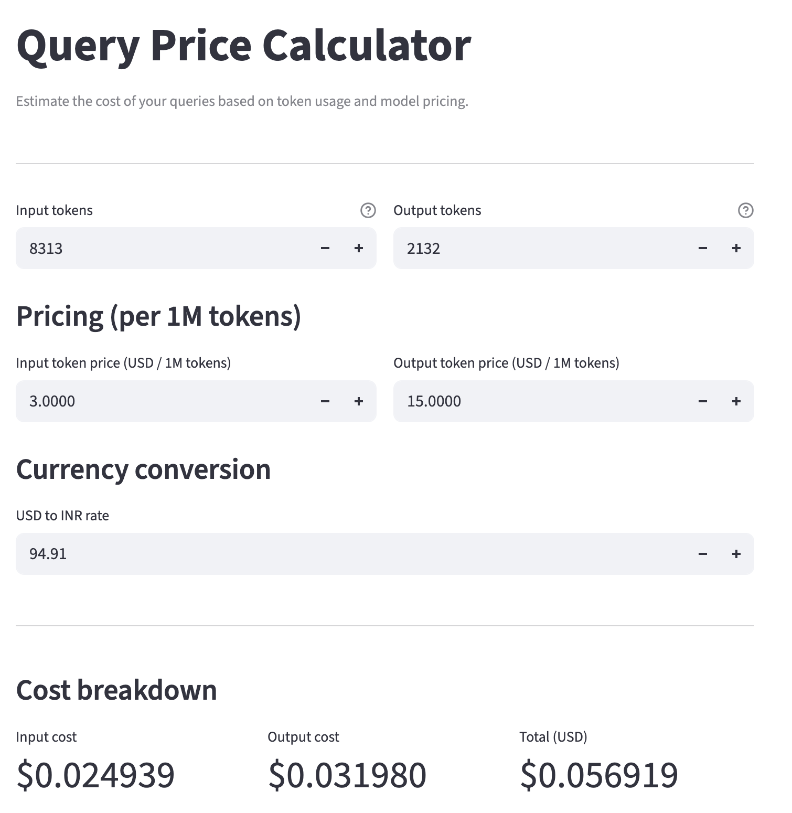

# Delly Data Analyst PoC

A PoC that lets you upload one or more CSVs, ask questions in plain English, and get back analysis, charts, and a verified explanation. Built around four sub-agents, each of which can use its own LLM. The system is designed not just to answer questions, but to be **HONEST ABOUT WHEN IT MIGHT BE WRONG**.

---

## What we built

The system has four pieces working together:

- Four agents — `data_insight`, `code_generation`, `execution`, `reasoning` - each with its own job and an optional per-agent LLM override.
- Multi-CSV ingest with SQLite — upload CSVs, they get streamed into a SQLite store with chunked progress reporting.
- Deterministic relationship discovery — pairwise column-overlap analysis to suggest foreign keys; user confirms before any are registered.
- Dual execution engines — the LLM picks SQL or pandas per query; SQL goes through SQLite, pandas runs in a sandboxed namespace.
- Provenance — the reasoning agent emits JSON `{text, measurements, evidence_kind, evidence_ref}` claims; a deterministic resolver checks every claim against the actual result.
- Auto verification checks — eight server-side checks fire after every analysis (groupby totals reconcile, no surprise NaNs, referenced tables exist, etc.).
- Retry loop — if the analysis returns suspicious empty results, code generation gets one retry with the previous code and failure reason in the prompt.
- Citations - every LLM call, every code execution, and every claim's evidence is visible in the UI.

---

## Architecture

### The pipeline

```
                        ┌──────────────────────┐
       df + question ──▶│  DataInsightAgent    │
                        │  • profile each table │
                        │  • narrate FKs        │
                        └──────────────────────┘
                                    │
                                    ▼
                        ┌──────────────────────┐
                        │  CodeGenerationAgent │
                        │  1. query understand  │  → engine: sql | pandas
                        │  2. write code        │     tables_needed: [...]
                        │  3. plot code         │     joins: [...]
                        └──────────────────────┘
                                    │
                                    ▼
                        ┌──────────────────────┐
                        │  ExecutionAgent      │
                        │  • SQL → store       │  ← retry loop here on
                        │  • pandas → sandbox  │     suspicious empty results
                        │  • render plot       │
                        └──────────────────────┘
                                    │
                                    ▼
                        ┌──────────────────────┐
                        │  ReasoningAgent      │
                        │  → structured claims │  → resolved against result by
                        │     {text, measure-  │     the deterministic verifier
                        │      ments, ref}     │
                        └──────────────────────┘
                                    │
                                    ▼
                          provenance + auto checks
```

### Project layout

```
data_analyst_agent/
├── app.py                        # Streamlit UI
├── core/
│   ├── llm.py                    # LLMConfig + per-agent override + providers
│   │                             # (Anthropic/OpenAI/AWS Bedrock/Mock)
│   ├── table_store.py            # SQLite-backed table registry + FK migration
│   ├── relationships.py          # Deterministic relationship discovery
│   ├── data_io.py                # CSV loader with dtype optimisation
│   ├── context.py                # AnalysisContext shared between agents
│   ├── agent_base.py             # Agent ABC + JSON/code extraction helpers
│   ├── orchestrator.py           # Pipeline runner + retry loop
│   ├── provenance.py             # Claim resolver + measurement grounder
│   ├── verification.py           # Auto-checks + on-demand baselines
│   └── logging_util.py           # Per-agent loggers + ring buffer for UI
├── agents/
│   ├── data_insight.py
│   ├── code_generation.py        # Splits into 3 sub-prompts
│   ├── execution.py              # Restricted-builtin sandbox
│   └── reasoning.py              # Emits structured claims
└── examples/demo.py              # Offline end-to-end demo (uses MockLLM)
```

### Key abstractions, briefly

- **`LLMConfig`** has every field optional. The orchestrator merges each agent's config with the default — anything unset on the agent inherits, anything set wins. Lets you do `default=Sonnet, override(data_insight=Haiku)` cleanly.
- **`AnalysisContext`** is the shared state. Every agent reads what it needs and writes its output. The orchestrator owns lifecycle.
- **`TableStore`** wraps a SQLite database. Schema introspection, chunked ingest, foreign key registration, and `query_pandas()` for the SQL engine path.
- **`ResolvedClaim`** is the unit of provenance — text + evidence reference + resolved value + grounding status.

---

## How to use it

### Setup

```bash
git clone <repo>
cd data-analyst
python3.12 -m venv .venv     # used 3.12
source .venv/bin/activate
pip install -r requirements.txt
```

For LLM access:

```bash
export AWS_REGION=us-east-1
export AWS_BEARER_TOKEN_BEDROCK=...   # long-term API key from Bedrock console

# Or direct providers
export ANTHROPIC_API_KEY=...
export OPENAI_API_KEY=...
```

### Run

```bash
streamlit run app.py
```

Configured in `.streamlit/config.toml`.

### Workflow

1. Pick LLMs in the sidebar.
2. Upload one or more CSVs.
3. Confirm relationships
4. Ask questions :  The agent picks SQL or pandas, executes, and explains. Citations show which cells/rows in the result back each claim.
5. Verify when needed

---

## How to replicate it

If you're building your own agent and want to incorporate the patterns rather than the whole codebase :

### 1. The per-agent LLM pattern

```python
@dataclass
class LLMConfig:
    provider: Optional[str] = None
    model: Optional[str] = None
    temperature: Optional[float] = None
    # ...
    def merged_with(self, default):
        return LLMConfig(
            provider=self.provider or default.provider,
            model=self.model or default.model,
            ...
        )
```

Each agent stores an `LLMConfig` (possibly all-None). At construction the orchestrator merges with the default and binds a client - cost optimisation per stage.

### 2. Structured claims for provenance

Replace freeform "explain this result" prose with:

```json
{
  "summary": "...",
  "claims": [
    {
      "text": "March had the highest signups with 481 users",
      "measurements": [481],
      "evidence_kind": "stat",
      "evidence_ref": {"stat": "max", "col": "signup_count"}
    }
  ]
}
```

A deterministic resolver: for each claim, walk the path against the actual result, extract numbers from the `measurements` field, and check they match. Six evidence kinds cover most cases: `cell`, `row`, `column`, `scalar`, `shape`, `stat`.

WIN : catches LLM hallucination of specific numbers without LLM-on-LLM judging. The verifier is deterministic — if it says a claim doesn't ground, it doesn't ground.

The Subtlety: the LLM must declare which numbers in the text are *measurements* vs *labels* ("January 2025" — 2025 is a label). Without this distinction, you get false positives on every date claim.

### 3. Deterministic relationship discovery

For multi-table contexts, do **not** ask the LLM to find foreign keys. Do this instead:

```python
for col_a in table_a.columns:
    for col_b in table_b.columns:
        if dtype_compatible(col_a, col_b):
            a_set = distinct_values(col_a, limit=5000)
            b_set = distinct_values(col_b, limit=5000)
            containment = len(a_set & b_set) / len(b_set)
            if containment > threshold and uniqueness(parent) > 0.95:
                yield candidate(parent, child, confidence)
```

Confidence scoring lets the user prioritise. Always require confirmation before treating a candidate as a real FK. Auto-confirming high-confidence candidates is tempting and wrong.

### 4. Engine selection for code generation

Don't force the LLM to write pandas for everything. Have query understanding emit `engine: "sql" | "pandas"`. SQL handles multi-table joins concisely; pandas handles windows, melt/pivot, anything stateful. Single shared interface to the result (everything ends up as a DataFrame).

### 5. The retry loop that actually helps

A naive retry loop ("it failed, try again") burns tokens. The version that earned its keep:

- Triggers on **suspicious empty results** (aggregate intent + 0 rows, all-NULL aggregates) plus exceptions
- Feeds the previous code back into the prompt with the failure reason
- Caps at 1 retry for PoC - can be set according the complexity
- Reasoning runs *once*, on the final state, so you don't pay for explanation twice

The trigger condition is the important part. Don't retry on every empty result — sometimes empty is correct.

## WIP
### 6. The verification sandbox
The **on-demand** verification buttons (`describe()`, sample re-run, row counts). They give the user a way to cross-check the agent's claims against ground truth, deterministically. Keep humans in the loop for high-stakes verification — automatic verification can only check structural consistency.

The **automatic** checks should be deterministic and cheap. The eight checks we have:

1. Code executed without exception
2. `result` variable produced
3. Result is non-empty
4. Referenced tables exist
5. Referenced columns exist
6. No surprise NaNs (input had none, result does)
7. Row count plausible (aggregate doesn't return more rows than input)
8. Groupby totals reconcile (sum across groups matches input column sum) — **the most valuable one**

#8 is the only check that does real cross-validation math. Reproduce it in your system if nothing else.

---

## Observations

These are in rough order of "things I'd flag to anyone building something similar."

### LLMs lie about empty results

The most expensive failure mode we hit. The LLM writes broken SQL (wrong join condition, wrong column name), the query returns 0 rows, and the LLM **confidently narrates the emptiness** — "the order_items table appears to be empty" — when the table has 43k rows.

Fix: make empty/None results trigger a code-generation retry, not a reasoning narration. In the reasoning prompt, explicitly forbid empty-data claims unless the result genuinely is empty AND the original SQL is sane.

This bug was responsible for ~half the user-visible problems during development. It hides because each individual hallucination sounds plausible.

### Foreign key registration silently dropped data

When we added `register_foreign_key`, the original implementation did this:
1. Rename `child_table` → `_tmp_child_table`
2. Create new `child_table` with FK constraint
3. INSERT data back from `_tmp_*`

With `PRAGMA foreign_keys = ON`, the INSERT silently rejected rows whose foreign key referent didn't exist yet. We ended up with empty real tables and full `_tmp_*` shadows — and the agent got "no data" for every joined query.

The lesson: any data-mutating step needs a check. Silent row loss is the worst kind of bug.

### The "labels vs measurements" distinction

Early version of the verifier treated *every* number in a claim as a measurement. This produced relentless false positives:
- "January **2025** had 424 signups" → `2025` not found in cell `[424]`
- "**75%** of products are at or below $210" → `75` not found
- "Across **11** months" → `11` not found

Fix : start with regex heuristics (years, percentile labels). Then realising this never ends — there's always a new label pattern. The structural fix is to have the **LLM declare measurements explicitly** in the claim schema. Then the verifier doesn't guess.

The heuristic stays as a fallback for when the LLM forgets the field.

### Single-row results confused LLMs

When `SELECT AVG(...) FROM ...` returns one row with one cell, smaller LLMs sometimes say "the query returned no results." The DataFrame is non-empty; they just see `(1, 1)` and treat it as nothing.

Fix: in the reasoning prompt, explicitly state `RESULT IS A NON-EMPTY DataFrame with 1 row(s) and 1 column(s)` and forbid empty-data narratives unless that count is zero.

### Wrong evidence_kind is a frequent LLM error

Common pattern: a claim like "the top 10 products" gets `evidence_kind: "column"` because the claim is *about* a column. But the number `10` in the claim is a row count, which is a `shape` thing.

Fix: in the reasoning prompt, separate "what is the claim about" from "what kind of evidence backs the number." Add explicit examples of count-claims using `shape`.

This requires the LLM to think about the claim's *measurements* independently from its *subject*. Most LLMs need a worked example to get it right.

### `df` vs `dfs` confusion in multi-table contexts

When 6 tables are loaded but only one is needed for a query, smaller LLMs default to writing `df.groupby(...)` from training-data muscle memory. The execution namespace doesn't have `df`, only `dfs["products"]`.

Fix: two changes — (a) the namespace exposes `df` whenever the *plan* says one table is needed (not just when one table is loaded), and (b) the prompt explicitly forbids `df` and provides worked examples using `dfs["..."]`.

### SQLite's ( Databases) silent failure modes

Beyond the FK-INSERT problem, SQLite has other quiet ways to lose data:
- `PRAGMA foreign_keys` is OFF by default — turn it on intentionally
- `to_sql(if_exists="append")` doesn't validate column order
- `pd.read_csv` with the pyarrow engine doesn't honor `chunksize` — use the C engine for chunked reads

Each one of these caused at least one debugging session.

Always `tempfile.gettempdir()`, never hard-code `/tmp`.

---

## Common errors and how to handle them

### Setup issues

You ran `streamlit run app.py` from inside the package directory. The package needs to be on `sys.path`, which means the **parent** directory needs to be on it. Move `app.py` to the parent directory (alongside `data_analyst_agent/`, not inside it), then run from there.

Streamlit and pip are using different Pythons. Common when streamlit is from Homebrew but you're working in a venv. Fix: `python -m streamlit run app.py` to force the venv's interpreter.

### "Result tab shows None" but data is real

Likely causes, in order of likelihood:
1. FK registration corrupted the table. Check the SQLite file directly: `SELECT COUNT(*) FROM <table>`. If the count is 0 but `_tmp_<table>` has rows, the migration broke. Drop the database, restart, re-upload.
2. Silent SQL error.

### "Citations show warning for valid-looking claims"

Two patterns to check:
1. Wrong evidence_kind. A row-count claim (`"top 10"`) should use `kind=shape`, not `kind=column`. Update the reasoning prompt with explicit guidance.
2. Multi-measurement single-cell claim. Claim cites two numbers (ratio AND view count) but `evidence_ref` points to one cell. Apply the multi-measurement broadening in the resolver: when measurements > 1, also expose the whole row as evidence.

### "Agent says 'no results' but the data is there"

Almost always a code-generation bug, not a data bug. Steps:
1. Open the Code tab in the per-agent breakdown. Read the SQL.
2. Run that SQL directly against your SQLite db (use a script).
3. If SQL returns rows: the bug is between SQL and reasoning. Check `ctx.analysis_result` actually got populated (add some logs).
4. If SQL returns nothing: the LLM wrote bad SQL. Check column names, join conditions, `WHERE` clauses with hard-coded enum values that don't exist (e.g. `event_type='add_to_cart'` when the actual values are `'cart'`).

---

## Debugging guide

### Inspecting the SQLite store while the app is running

```python
import sqlite3, glob, os, tempfile

candidates = sorted(
    glob.glob(os.path.join(tempfile.gettempdir(), "data_analyst_*.sqlite")),
    key=os.path.getmtime, reverse=True,
)
db = candidates[0]
con = sqlite3.connect(db)

# Tables and row counts
for (name,) in con.execute("SELECT name FROM sqlite_master WHERE type='table'"):
    n = con.execute(f'SELECT COUNT(*) FROM "{name}"').fetchone()[0]
    print(f"  {name}: {n} rows")

# Foreign keys
for (name,) in con.execute("SELECT name FROM sqlite_master WHERE type='table'"):
    fks = list(con.execute(f'PRAGMA foreign_key_list("{name}")'))
    if fks:
        print(f"  FK on {name}: {fks}")
```

The number of `_tmp_*` tables is a leading indicator of FK migration trouble.

### Tracing what the LLM saw

Every LLM call is logged with prompt sizes and latency. Open the Logs tab in any answer's per-agent breakdown, enable "Show payloads", and you can see the exact system + user prompt sent to each agent. If the reasoning is wrong, look at what reasoning was *given*. Most reasoning bugs are actually missing-context bugs.

### Adding debug output to a specific agent

The `timed` context manager makes this easy:

```python
from ..core.logging_util import get_logger, timed
log = get_logger("my_agent")

with timed(log, "my expensive step"):
    result = ...
log.info("intermediate value", extra={"payload": str(result)[:1000]})
```

Output appears both in stderr and in the in-app Logs tab.

### Verifying the resolver against synthetic data

Best way to test provenance changes:

```python
import pandas as pd
from data_analyst_agent.core.provenance import resolve_claims

result = pd.DataFrame({"region": ["N", "S"], "rev": [100, 200]}).set_index("region")
claims = [
    {"text": "North had 100", "measurements": [100],
     "evidence_kind": "cell", "evidence_ref": {"row": "N", "col": "rev"}},
    {"text": "South had 999", "measurements": [999],   # deliberate lie
     "evidence_kind": "cell", "evidence_ref": {"row": "S", "col": "rev"}},
]
for rc in resolve_claims(result, claims):
    print(rc.status, rc.text)
```

Should print `pass` for the first, `warn` for the second. If both pass, the grounder is broken. If both warn, the resolver is broken.

### When to suspect each layer

| Symptom                                          | Suspect first                  |
|--------------------------------------------------|--------------------------------|
| Confident "no data" answer despite real data     | Code generation (broken SQL)   |
| warning on a number that's clearly correct            | Wrong evidence_kind, OR multi-measurement single-cell |
| Fail "column 'X' not in result"                  | LLM cited input-table column instead of result column |
| Plot fails, analysis doesn't                     | dtype confusion after join     |
| Multi-table query worked, then stopped           | FK registration corrupted a table |
| Single-CSV query fails mysteriously              | `df` vs `dfs` confusion        |

---

## Query Price Calculator

Every query displays its token consumption (input / output / total) inline. To estimate the actual cost, use the built-in price calculator page at `/query_price_calculator`.

Enter the token counts from any query, set the per-1M-token pricing from AWS Bedrock, and get the cost in both USD and INR (with a configurable conversion rate).



For reference: a typical query against the 170k - row ecommerce dataset costs ~10k tokens ($0.00006). Sending the same data raw to the LLM would cost ~2.6M input tokens ($7.80) per query - the code - generation approach is way cheaper.

---

## What we'd do next

How it will be integrated with getdelly.com

- Real sandboxing. The current "restricted builtins + import blocklist" is best-effort and not a security boundary. Use a container.
- Replace SQLite with DuckDB/PostgresQL. Same SQL surface, much better analytical performance, native pandas integration, real window functions.
- Cache the data-insight summary across questions. It rarely changes between turns and it's the most expensive non-execution cost.
- Add measurement-level provenance from arithmetic. Right now we verify "this number appears in the result." A stronger version verifies "this number is the sum/mean/max of these other cells" — full computational provenance. High on the deterministic scale.
- Streaming responses. Current pipeline is fully synchronous..

The architecture supports all of these as drop-in changes.

